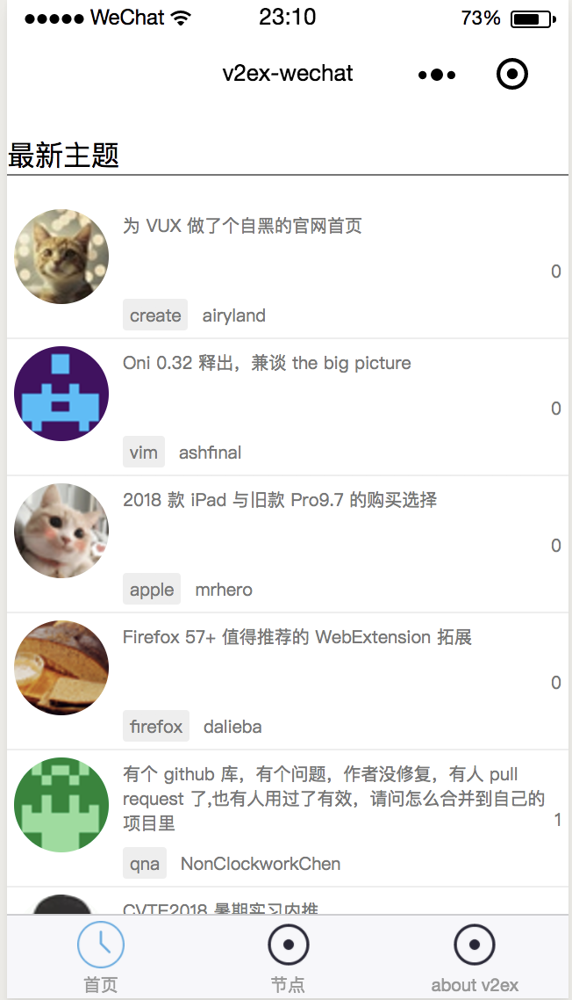
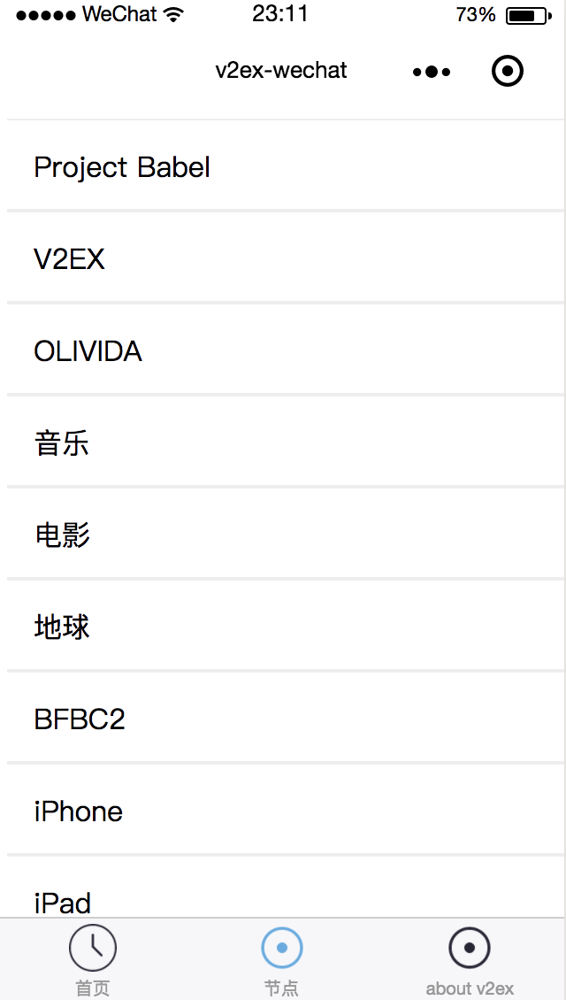
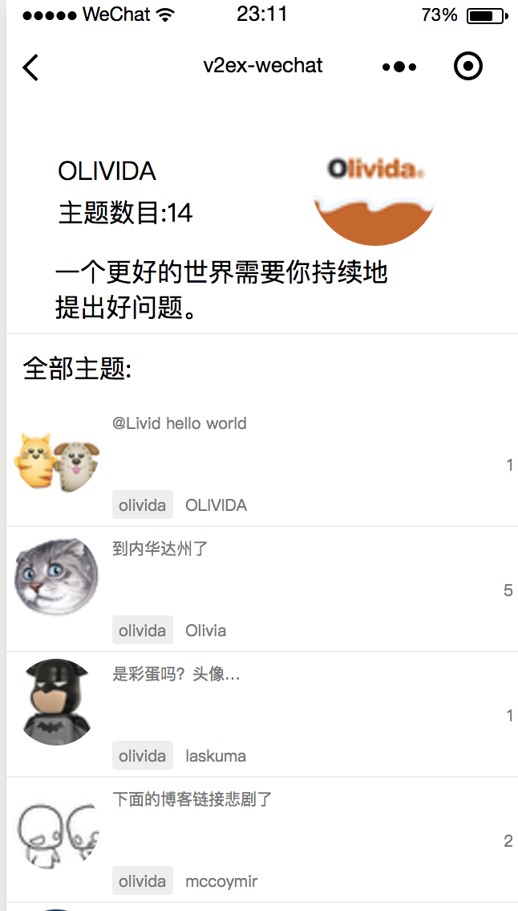
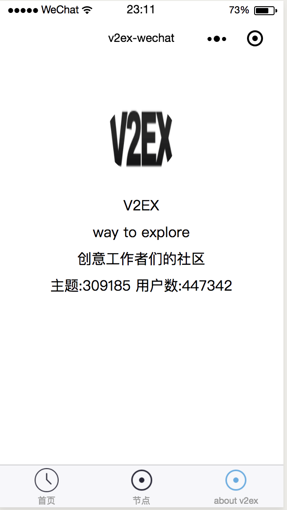

# v2ex-wechat
> v2ex 微信小程序原生框架demo
## 前言
微信小程序 基础文档 请参考 微信官方文档《https://developers.weixin.qq.com/miniprogram/dev/index.html》

## 相关API
```
https://www.v2ex.com/

//获取最新主题
/api/topics/latest.json
//获取最热主题
/api/topics/hot.json
//帖子详情页 ?id=1
/api/topics/show.json
//帖子回复数目 ?topic_id=1 and page
/api/replies/show.json
//获取网站信息
/api/site/info.json
//取网站状态
/api/site/stats.json
//获取所有节点
/api/nodes/all.json
//获取节点详情页 name=babel&id=1
/api/nodes/show.json
//获取当前节点下的主题 node_name = v2ex
/api/topics/show.json
```

效果截图

  

  

  

  

## 说明
由于学习，开始了微信小程序的学习，完成了首个原生微信小程序mina框架开发的v2ex的微信小程序,
为了属性组件以及接口API，欢迎大家start
转载 请著名出处，thx～

## 感谢 
v2ex 部分数据api参考了仓库[jectychen](https://github.com/jectychen/wechat-v2ex)
